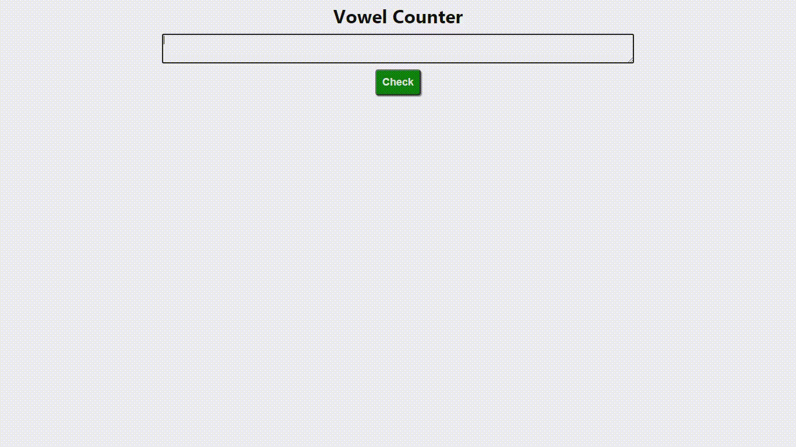

## <h1 align="center">Vowel Counter</h1>

<p align="center">


</p>

<h2 align="center"><a href="https://mr85-react-vowelcounter.netlify.app/">Live Demo</a></h2>

## Description

<p align="center">
</p>

<p>create-react-app project</p>

## Project setup

```
npm install
npm start
```
